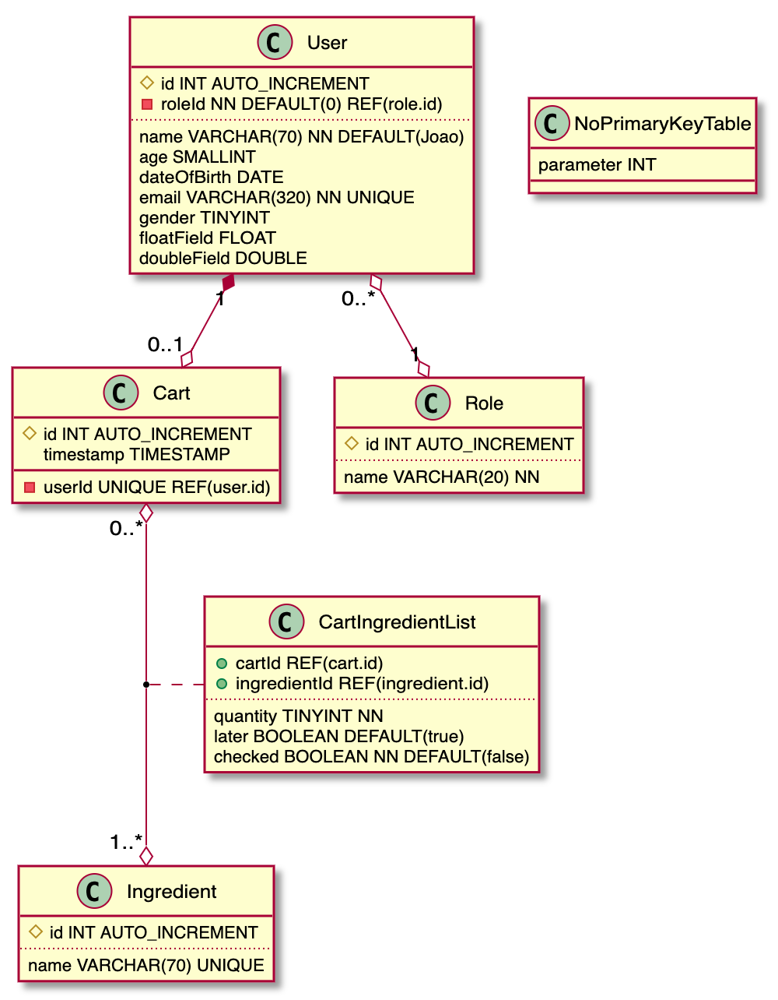

# plantuml2mysql
Parse plantuml class diagrams into mysql

## Installation

npm i plantuml2mysql

## Usage

```typescript
import plantuml2mysql from 'plantuml2mysql'
import fs from 'fs'

plantuml2mysql('./database.md').then(
  (result) => {
    fs.writeFileSync('./database.sql', result)
  }
)

```

## Plantuml Class example

```
@startuml database diagram
  class Cart {
    #id INT AUTO_INCREMENT
    -userId UNIQUE REF(user.id)
    timestamp TIMESTAMP
  }

  class CartIngredientList {
    +cartId REF(cart.id)
    +ingredientId REF(ingredient.id)
    ..
    quantity TINYINT NN
    later BOOLEAN DEFAULT(true)
    checked BOOLEAN NN DEFAULT(false)
  }

  class Ingredient {
    #id INT AUTO_INCREMENT
    ..
    name VARCHAR(70) UNIQUE
  }
  
  class User {
    #id INT AUTO_INCREMENT
    -roleId NN DEFAULT(0) REF(role.id)
    ..
    name VARCHAR(70) NN DEFAULT(Joao)
    age SMALLINT
    dateOfBirth DATE
    email VARCHAR(320) NN UNIQUE
    gender TINYINT
    floatField FLOAT
    doubleField DOUBLE
  }
  
  class Role {
    #id INT AUTO_INCREMENT
    ..
    name VARCHAR(20) NN
  }

  class NoPrimaryKeyTable {
    parameter INT
  }
  
  User "0..*" o--o "1" Role

  User "1" *--o "0..1" Cart

  Cart "0..*" o--o "1..*" Ingredient
  (Cart, Ingredient) .. CartIngredientList

@enduml
```



## Column structure

**Example columns**
- \#id INT AUTO_INCREMENT
- checked BOOLEAN NN DEFAULT(false)

**Structure**
1. Key type (#, -, +), this is optional
2. Column name
3. column data type
4. any other properties

## Detailed metadata

|meta data| description | example |
|-|-|-|
| # | Primary key | #id |
| - | Foreign key | -userId |
| + | Primary key and Foreign key, for relation tables | +cartId |
| AUTO_INCREMENT | auto increment field |
| UNIQUE| adds a unique index to the field |
| REF(table.column) | sets the foreign key reference | REF(user.id) |
| NN | Not Null field |
| DEFAULT(value) | sets the default value | DEFAULT(10) |
