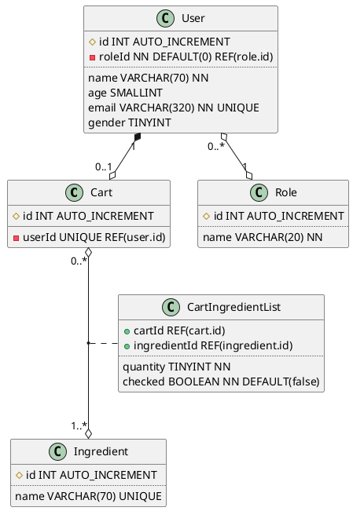

```plantuml
@startuml database diagram
  class Cart {
    #id INT AUTO_INCREMENT
    -userId UNIQUE REF(user.id)
  }

  class CartIngredientList {
    +cartId REF(cart.id)
    +ingredientId REF(ingredient.id)
    ..
    quantity TINYINT NN
    checked BOOLEAN NN DEFAULT(false)
  }

  class Ingredient {
    #id INT AUTO_INCREMENT
    ..
    name VARCHAR(70) UNIQUE
  }
  
  class User {
    #id INT AUTO_INCREMENT
    -roleId NN DEFAULT(0) REF(role.id)
    ..
    name VARCHAR(70) NN
    age SMALLINT
    email VARCHAR(320) NN UNIQUE
    gender TINYINT
  }
  
  class Role {
    #id INT AUTO_INCREMENT
    ..
    name VARCHAR(20) NN
  }
  
  User "0..*" o--o "1" Role

  User "1" *--o "0..1" Cart

  Cart "0..*" o--o "1..*" Ingredient
  (Cart, Ingredient) .. CartIngredientList

@enduml
```