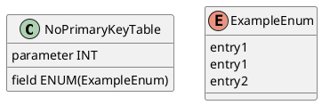

```plantuml
@startuml database diagram
  class NoPrimaryKeyTable {
    parameter INT
    field ENUM(ExampleEnum)
  }

  enum ExampleEnum {
    entry1
  }
  enum ExampleEnum {
    entry1
    entry2
  }
@enduml
```